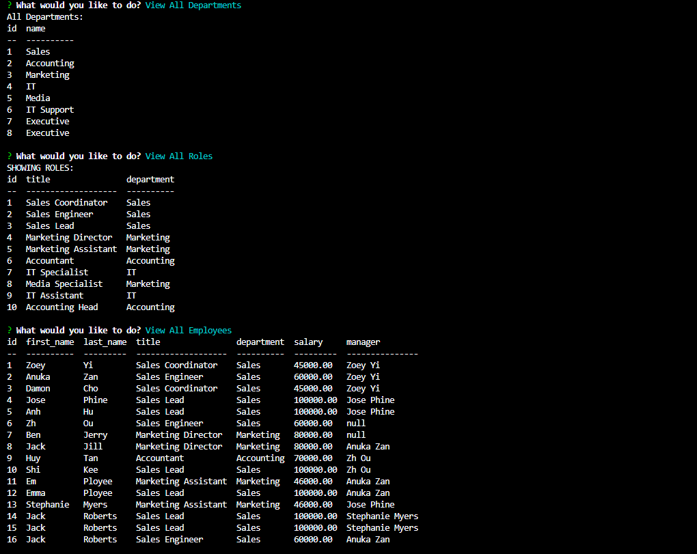

# Employee Tracker

  ## Description
Developers frequently have to create interfaces that allow non-developers to easily view and interact with information stored in databases. I built a command-line application from scratch to manage a company's employee database, using Node.js, Inquirer, and MySQL.
  

  ## Table of contents
  - [Installation](#Installation)
  - [Usage](#Usage)
  - [How To Contribute](#How-to-Contribute)
  - [License](#License)
  - [Tests](#Tests)
  - [Questions](#Questions)

  ## Installation
  Install Node (npm install node) and Inquirer (npm install inquirer). Make sure you already have NPM installed.

  ## Usage
  Run "node server to start inquirer in your terminal after downloading the necessary dependencies
   [Watch the video](https://drive.google.com/file/d/1kYAJv0Eaa5xhIjuo4IrxosUesMeJ_7Hv/view)
     

  ## How to Contribute 
  Please refer to https://www.contributor-covenant.org/
  
  ## License
  This project is licensed under MIT

  ## Tests
  Please run node server to see if questions are populating

  ## Questions
  If you have any questions, please contact me at anukazan@gmail.com. You can view my projects at https://github.com/AnukaZan.
